# predictN2O - Architecture Overview

<div align="center">


**🌱 Machine Learning Pipeline for N₂O Emission Forecasting in Wastewater Treatment Plants**

</div>


## Core Architecture

```mermaid
graph TB
    %% User Interfaces
    CLI[🖥️ CLI Interface<br/>main.py]
    WEB[🌐 Web Interface<br/>web_app.py] 
    JUPYTER[📓 Jupyter Notebooks<br/>EDA & Analysis]
    
    %% Core System
    subgraph CORE[🧠 Core System]
        CONFIG[⚙️ YAML Configuration<br/>Reproducible Settings]
        PLUGINS[🔌 Plugin Registry<br/>Dynamic Feature Loading]
        ANALYZER[🔍 Dataset Analyzer<br/>Auto-Configuration]
    end
    
    %% Data Processing
    subgraph DATA[📊 Data Processing]
        LOADER[📥 Data Loader<br/>CSV + Validation]
        FEATURES[🛠️ Feature Engineering<br/>Lag • Rolling • Time]
        SPLIT[🔄 Time-Series Split<br/>Train/Test]
    end
    
    %% ML Pipeline
    subgraph ML[🤖 ML Pipeline]
        MODELS[🎯 6 ML Models<br/>RF • XGBoost • KNN • DNN]
        EVAL[📈 Evaluation<br/>Metrics • SHAP • Permutation]
    end
    
    %% Results
    RESULTS[💾 Results<br/>Models • Metrics • Plots]
    
    %% Flow
    CLI --> CORE
    WEB --> CORE  
    JUPYTER --> CORE
    CORE --> DATA
    DATA --> ML
    ML --> RESULTS
    
    %% Plugin Connection
    PLUGINS -.-> FEATURES
```



---

## Key Components

### **Plugin System**
```python
# Extensible Feature Engineering Plugins
class FeatureEngineeringPlugin(BasePlugin):
    def transform(self, df: pd.DataFrame, config: Dict) -> pd.DataFrame:
        pass

# Available Plugins:
# • lag_features.py - Time-lagged features  
# • rolling_features.py - Rolling statistics
# • time_features.py - Cyclical time features
```

### **YAML Configuration**
```yaml
# Scientifically reproducible configuration
data:
  data_path: "data/AltenrheinWWTP.csv"
  target_column: "N2O"
  feature_columns: ["DO", "T", "Q_in"]

models:
  available_models: ["RandomForest", "XGBoost", "KNN", "DNN"]
  default_model: "RandomForest"

plugins:
  feature_engineering:
    enabled_plugins: ["lag_features", "rolling_features", "time_features"]
```

### 📊 **Data Flow**

```mermaid
sequenceDiagram
    participant User as 👤 User
    participant Config as ⚙️ Config
    participant Data as 📊 Data
    participant Plugins as 🔌 Plugins
    participant ML as 🤖 ML
    participant Results as 💾 Results
    
    User->>Config: Load Configuration
    Config->>Data: Process Raw Data
    Data->>Plugins: Apply Feature Engineering
    Plugins->>ML: Enhanced Features
    ML->>Results: Trained Models + Metrics
    Results->>User: Complete Analysis
```



## 🛣️ Development Roadmap

### ✅ **Current (2025)**
- Core plugin system implementation
- 6 ML models with hyperparameter tuning
- Web interface and CLI tools
- evaluation with SHAP

### 🔮 **Future (2026)**
- Real-time API for live predictions
- Adding Feature Selection
- Optimizing Web Interface
- Additional data source integrations
- Advanced deep learning models
- Multi-site federated learning
- More deep neural networks like LSTM, CNN...

---

